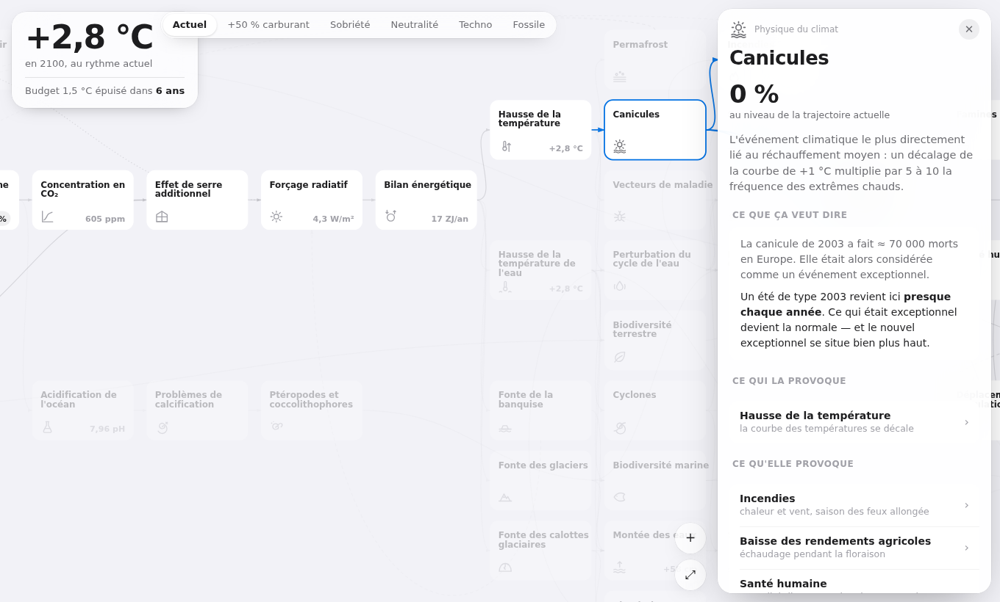

# Climat, Cause à Effet — simulateur interactif

Les 42 cartes de l'atelier, reliées par leurs liens de cause à effet, avec un modèle
physique derrière : on déplace une cause — le transport, la déforestation, la part des
énergies fossiles — et l'onde traverse la chaîne jusqu'aux famines, aux déplacements de
populations et aux conflits armés.

Dix cartes absentes du jeu officiel ont été ajoutées, dont quatre en permanence
(pollution de l'air, circulation océanique, ressources halieutiques, coût économique).

**Aucune dépendance, aucun build obligatoire, aucun serveur** : une seule page HTML
autonome, qui s'ouvre au double-clic.



Un seul chiffre en grand, les réglages posés sur les cartes elles-mêmes, une fiche qui
glisse depuis le bord. Police système, pictogramme par carte, onde de propagation animée.

## Se déplacer sur le plateau

Glisser pour se déplacer, molette ou pincement pour zoomer — le zoom suit l'amplitude
du geste, donc il reste doux au trackpad et franc à la molette. Double-clic : vue
d'ensemble. Sous 55 % de zoom, les cartes passent en silhouettes colorées.

## Démarrer

```bash
git clone https://github.com/PADreyfus/climat.git
cd climat
open index.html            # macOS — ou double-clic, ou :
python3 -m http.server     # puis http://localhost:8000
```

## Structure

```
index.html            la page servie — générée, ne pas l'éditer
src/index.html        la source d'édition
tools/build.mjs       enveloppe src/*.html dans un document HTML complet
docs/modele.md        le modèle physique, ses constantes et ses limites
docs/img/             capture
```

Le fichier de `src/` est au format « artifact » : il commence directement par `<title>`
et son contenu, sans `<html>` ni `<head>`, parce que la plateforme qui l'héberge ajoute
ce squelette à la publication. Pour un hébergement statique ordinaire il faut ce
squelette — c'est tout ce que fait le script de build.

```bash
node tools/build.mjs     # src/*.html → *.html à la racine
```

**On édite `src/`, jamais les fichiers de la racine** : ils sont écrasés à chaque build.
## Le modèle en trois lignes

Un noyau physique d'une douzaine de cartes, calibré sur le GIEC AR6 et le Global Carbon
Budget : le réchauffement suit le TCRE (0,45 °C par 1000 GtCO₂ cumulées), la
concentration découle de la fraction absorbée par les puits, le forçage de
5,35·ln(C/C₀), le niveau marin et le pH sont interpolés entre deux scénarios SSP. Trois
rétroactions — permafrost, incendies, albédo — rendent le système implicite : il est
résolu par point fixe. Les 35 autres cartes portent un indice relatif propagé dans le
graphe, moyenne pondérée des cartes amont élevée à un exposant de non-linéarité.

Référence (tous les curseurs au repos) : **+2,8 °C, 605 ppm, 42,6 GtCO₂/an, +58 cm,
pH 7,96, budget 1,5 °C épuisé dans 6 ans.**

### Ce que ça coûte

Le bandeau affiche en permanence sept sorties sensibles, recalculées à chaque geste :
part des espèces menacées d'extinction, niveau marin et population sous la ligne de
tempête, récoltes perdues traduites en rations annuelles, population hors de la zone
climatique habitable, récifs coralliens perdus, risque de famine et de conflit armé.
Chaque ligne ouvre la carte correspondante.

Ces chiffres sont des ordres de grandeur issus d'un modèle simplifié — ils servent à
faire sentir des proportions, pas à être cités.

### Les verrous

Le simulateur retient le **réchauffement le plus haut atteint** pendant la session.
Quand ce pic franchit le seuil d'un point de bascule — récifs et calottes à 1,5 °C,
glaciers à 2 °C, Amazonie à 3,5 °C, AMOC à 4 °C — la carte se verrouille et **ne se
déverrouille plus** : un cadenas apparaît, et l'élément garde un plancher dans le modèle.

Cette mémoire ne vaut que pour vos propres réglages : montez le transport à fond puis
redescendez-le, les verrous franchis au passage restent fermés. Charger un autre scénario
repart d'un monde neuf, comme le bouton ↺ — chaque scénario montre donc les seuils qu'il
franchit lui-même.

### Ce que ça vaut, ce que ça ne vaut pas

Les chiffres physiques sont des ordres de grandeur défendables. **Les pourcentages
affichés sur les cartes de conséquences ne sont pas des mesures** : ils sont ordinaux.
Ils disent correctement que les canicules réagissent plus fort que les crues, qui
réagissent plus fort que la biodiversité marine ; ils ne se lisent pas comme
« +37 % de canicules ». Il n'y a ni géographie, ni dimension temporelle autre que 2100,
ni adaptation, ni véritable discontinuité de bascule.

[Le détail des formules, des constantes et de leurs sources est dans `docs/modele.md`.](docs/modele.md)

## Licence et mentions

Code sous [licence MIT](LICENSE).

Projet personnel, **sans aucun lien avec l'association La Fresque du Climat** qui conçoit
et anime l'atelier de cartes dont il s'inspire. Les intitulés des cartes reprennent ceux
du jeu pour permettre de faire le lien avec l'atelier ; aucun visuel, aucune donnée et
aucun contenu de l'association n'est repris ici — les pictogrammes et les textes sont
originaux.
